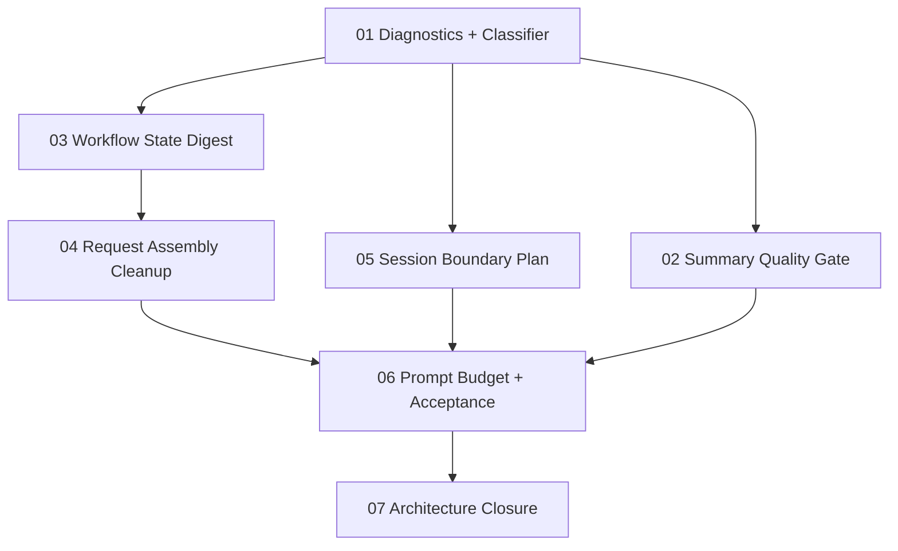

# 2026-07-15 Provider Context Economy General Fix Spec

## Status

Index spec. Implementation details are split into focused documents below.

## Goal

Fix the shared architecture problem behind Qwen context growth and GLM summary failure:

- runtime config, skill docs, and tool contracts must not be replayed as provider-visible conversation history;
- only workflow state should cross compact/session boundaries;
- provider session reuse/freshness must be explicit and testable;
- tool definitions must still be re-derived reliably after compact.

## Evidence Summary

Correct mapping from user browser exports:

- Tool-call session: `E:\下载\You are opencod...-20260715132324.json`
- Main session: `E:\下载\排查Chat2API工具调用问...-20260715132340.json`
- Summary session: `E:\下载\GLM摘要问题：RC1已证实，...-20260715132307.json`

Observed:

- Main Qwen session is 52 messages / 2.42MB and repeats `You are opencode` and `## Available Tools` 26 times.
- Tool-call session still starts with a 103KB user payload.
- Summary session still contains `superpowers` and `SUBAGENT-STOP`.

## Implementation Documents

Implement in this order:

1. [Context Diagnostics And Payload Classifier](./2026-07-15-context-economy-01-diagnostics-classifier.md)
2. [Summary Input Quality Gate](./2026-07-15-context-economy-02-summary-quality-gate.md)
3. [Workflow State Digest](./2026-07-15-context-economy-03-workflow-state-digest.md)
4. [Request Assembly Cleanup](./2026-07-15-context-economy-04-request-assembly-cleanup.md)
5. [Provider Session Boundary Plan](./2026-07-15-context-economy-05-session-boundary-plan.md)
6. [Prompt Budget And Acceptance Tests](./2026-07-15-context-economy-06-prompt-budget-acceptance.md)
7. [Architecture Closure And Legacy Path Retirement](./2026-07-15-context-economy-07-architecture-closure.md)

## Dependency Order

## Global Non-Negotiables

- Do not fix this by model-specific parser tweaks.
- Do not increase provider context as the solution.
- Do not delete tool-definition preservation behavior without replacing it with stronger tool-catalog re-derivation tests.
- Do not accept internal key-change tests alone; provider request shape and exported/browser evidence must also match.
- `ToolCallingEngine` remains the single owner of tool prompt injection.
- Do not leave dedicated adapter paths, backward-compat prompt modes, or old "preserve tool definitions as history" tests as unbounded bypasses.

## Final Acceptance

The full spec is accepted only when:

- Qwen long compact probe passes and exported main session stops growing with repeated full OpenCode/tool/skill config.
- GLM short probe passes and summary child sessions no longer receive placeholder-only or skill-doc-only input.
- GLM compact probe passes or has a documented provider-side blocker.
- Deterministic tests prove tool definitions survive compact by re-derivation, not by replaying old tool-contract history.
